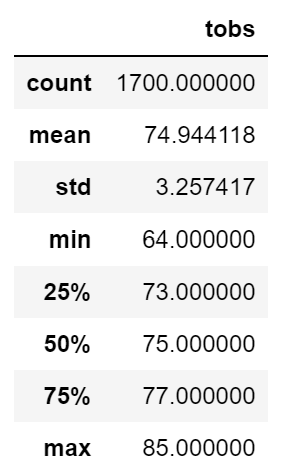
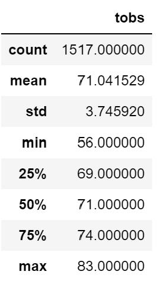

# surfs_up
DABC Module 9

2022-08-13

Laurina LaStella

# Overview of the analysis: 
## Review temperature data for the months of June and December in Oahu, in order to determine if the surf and ice cream shop business is sustainable year-round.
---
---

# Results: 
## Temperatures (in F)
- Mean temperature is 75 in June, 71 in December.
- Minimum temperature is 64 in June, 56 in December.
- Maximum temperature is 85 in June, 83 in December.

#### June, all years:

#### December, all years:

---
---

# Summary:

## December temperatures are lower than June temperatures, as would be expected. But the average is similar, from 71 in December to 75 in June. 

## The business would probably not see significant changes in customers, based on temperatures alone.

## Other queries recommended for deeper understanding:

### 1. Precipitation statistics would help determine how many days of business may be lost to rain in each season, despite the ambient temperature.

### 2. Elevation of each station may impact readings. Since surfing is done at sea level, further analysis may benefit from eliminating readings from stations at higher elevations.
